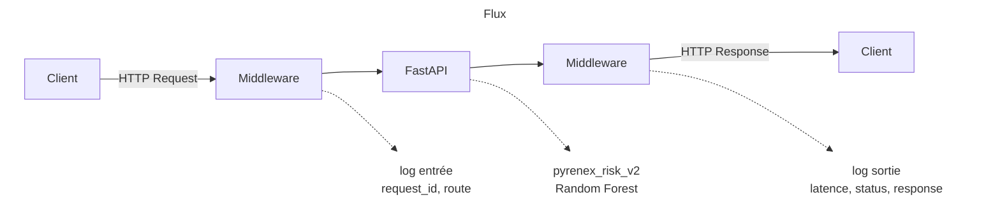

# M1-B2 — Squelette repo (Pyrenex Crédit scoring API)

---

## Architecture

## 🚀 Démarrage

```bash
# 0. Build docker
docker build -t pyrenex-risk-api:v0.1.0 .  

# 1. Docker run
docker run -d -p 8000:8000 --name pyrenex-api pyrenex-risk-api:v0.1.0

# 2. Check health stautus ==> Healthy after 10 seconds
 docker ps -a  
```


Requete Postman  :

```
{
  "info": {
    "_postman_id": "e5a04596-eba0-44f2-872a-fa0755c2b8d5",
    "name": "M1-B2",
    "schema": "https://schema.getpostman.com/json/collection/v2.1.0/collection.json",
    "_exporter_id": "15131619"
  },
  "item": [
    {
      "name": "Predict",
      "request": {
        "method": "POST",
        "header": [],
        "body": {
          "mode": "raw",
          "raw": "{\r\n  \"loan_amnt\": 1000,\r\n  \"int_rate\": 1,\r\n  \"installment\": 50,\r\n  \"annual_inc\": 10000,\r\n  \"dti\": 0.5,\r\n  \"delinq_2yrs\": 5,\r\n  \"fico_range_low\": 10,\r\n  \"revol_util\": 100,\r\n  \"term\": \"string\",\r\n  \"grade\": \"string\",\r\n  \"home_ownership\": \"string\",\r\n  \"verification_status\": \"string\",\r\n  \"purpose\": \"string\",\r\n  \"emp_length\": \"string\"\r\n}",
          "options": {
            "raw": {
              "language": "json"
            }
          }
        },
        "url": {
          "raw": "http://localhost:8000/predict",
          "protocol": "http",
          "host": [
            "localhost"
          ],
          "port": "8000",
          "path": [
            "predict"
          ]
        }
      },
      "response": []
    }
  ]
}
```

## 📁 Structure du repo

```
M1-B2-scoring-api-<prenom>/
├── app/
│   ├── __init__.py
│   ├── main.py                  # FastAPI app + lifespan + routes
│   ├── schemas.py               # Pydantic schemas (LoanApplication, Prediction)
│   └── middleware.py            # LoggingMiddleware Loguru
├── tests/
│   ├── __init__.py
│   ├── conftest.py              # fixtures pytest (client + valid_payload)
│   ├── test_model_contract.py   # test 0 — valide le .joblib avant l'API
│   └── test_api.py              # tests routes /health, /info, /predict
├── models/                      # ton .joblib + .json depuis M1-B1
│   └── .gitkeep
├── logs/                        # logs rotatifs (gitignored)
│   └── .gitkeep
├── ressources/                  # 📚 mini-cours d'appui (lecture juste-à-temps)
│   ├── 01_FastAPI_Pydantic_ml_essentiel.md
│   ├── 02_Dockerfile_Python_essentiel.md
│   ├── 03_Pytest_TestClient_essentiel.md
│   ├── 04_Loguru_middleware_essentiel.md
│   ├── 05_Versionning_modele_essentiel.md
│   ├── liens_officiels.md
│   └── README.md                # ordre de mobilisation + objectifs
├── Dockerfile                   # à compléter (cf. ressources/02)
├── .dockerignore
├── .gitignore
├── requirements.txt
└── README.md (ce fichier — à compléter avec schéma Mermaid + démarrage)
```